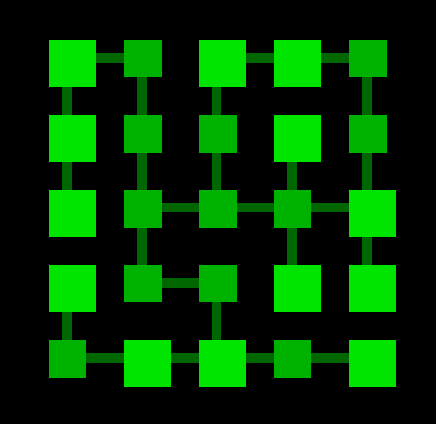

# Dungeon map generator

A dungeon-map generator algorithm to create procedural maps for 2D top-down videogames with randomness in the initialization of the rooms directions and possible paths (like **The Binding of Isaac**).  

>[!IMPORTANT]
> Scripting in **Lua**; graphics with **LÖVE2D** to render the map representation. You can use it according to the license. Take into account the libraries included.

## Some examples of map representations

| 4x4 rooms | 5x5 rooms | 7x7 rooms|
| -- | -- | -- |
|  |  |  |
